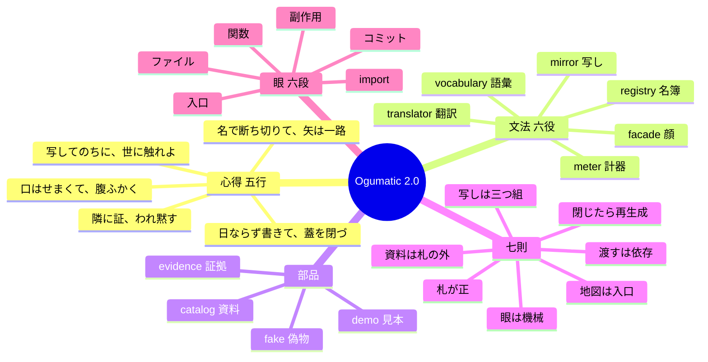

# Ogumatic Module Design

モジュールを**役割の段**で切り、正を**札・証拠・資料**に置き、コードを**生成物**として扱う設計術。

本寺の 10 年分（moaible / O6lvl4 / almide、216 リポジトリ）の癖を測って言語化した 1.0 を、
AI 時代向けの術として組み直した 2.0。

## 一文

```
写してのちに、世に触れよ
口はせまくて、腹ふかく
名で断ち切りて、矢は一路
隣に証、われ黙す
日ならず書きて、蓋を閉づ
```

## 命題

コードは安くなった。高いのは「どこに境界を引くか」の判断と「境界が守られているか」の検証である。
だから正を札・証拠・資料に移し、コードを生成物にする。写しは言語ごとに再生成してよい。持ち越すのは札と証拠だけ。

## 骨格



| 層 | 中身 | 文書 |
| --- | --- | --- |
| 心得 | 五行とその意味 | [docs/01-creed.md](docs/01-creed.md) |
| 文法 | 六役（vocabulary / meter / mirror / translator / registry / facade） | [docs/02-roles.md](docs/02-roles.md) |
| 部品 | 役以外に必ず置くもの（fake / catalog / evidence / demo） | [docs/03-parts.md](docs/03-parts.md) |
| 術 | 七則 | [docs/04-rules.md](docs/04-rules.md) |
| 眼 | 六段の機械検査の抽象定義 | [docs/05-eye.md](docs/05-eye.md) |
| 札 | 箱札 `box.yaml` の仕様 | [docs/06-card.md](docs/06-card.md) |
| 地図 | `ogumatic.yaml` の仕様 | [docs/07-atlas.md](docs/07-atlas.md) |
| 導入 | 既存 repo への入れ方と pin の作法 | [docs/08-adoption.md](docs/08-adoption.md) |
| 対照 | Atomic Design・CDK L1/L2/L3・Clean Architecture との突き合わせ | [docs/09-lineage.md](docs/09-lineage.md) |
| 語彙 | 日英対訳 | [docs/glossary.md](docs/glossary.md) |
| スキーマ | 札と地図の JSON Schema | [schema/](schema/) |
| 雛形 | CLAUDE.md・札・地図 | [templates/](templates/) |
| 眼の実装 | Almide。`almide install github.com/O6lvl4/ogumatic-module-design` | [src/](src/) |
| skill | Claude Code から `/ogumatic` | [skill/](skill/) |

## 状態

| 版 | 内容 |
| --- | --- |
| v0.1.0 | 抽象段階。文書・スキーマ・雛形・skill |
| v0.2.0 | 眼の試作（Python、正規表現）。閉じて再生成した |
| v0.3.0 | 眼を Almide で再生成。抽出器は gramide（Go・Rust・Python・Almide）。`almide install github.com/O6lvl4/ogumatic-module-design` → `ogumatic eye .` |

## 由来

1.0 の癖の実測（関数 5〜12 行、公開 3〜4 本、写し 1:1 テスト、19 package の相互依存 0 など）は
`docs/` の各文書に根拠として添えてある。数字は 2026-09-26 の計測。
