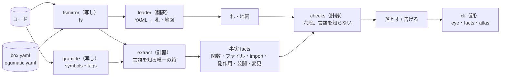

# 05 眼（eye）

六段の検査。言語に依存しない定義をここに置き、言語への写像は `eye/` に置く。

## 六段

| # | 段 | 測るもの | 落とす | 告げる | 根拠（手書き期の実測） |
| --- | --- | --- | --- | --- | --- |
| 1 | 関数 | 行数・引数・ネスト | 30 行超 | 引数 4 以上、ネスト 4 以上 | 中央値 5〜12、p90 14〜47、40 行超 0〜2% |
| 2 | ファイル | 型の数・行数 | 型宣言 2 つ以上（その型の extension / impl は除く）、120 行超 | 80 行超 | 中央値 21〜32、1 ファイル 1 型 52% |
| 3 | import | 札の `knows` | `knows` に無い箱を import | 役の表と食い違う `knows` | archgopher 許可表、dependency-cruiser |
| 4 | 副作用 | fs・net・process・時計・env・乱数 | mirror 以外での使用 | fake での使用 | archgopher 31 中 6、qusp-core 30/44 が違反 |
| 5 | 入口 | 公開シンボル | 札の `surface` に無い公開、facade で 5 本以上 | — | MOAspects 4、GADInjector 3 |
| 6 | コミット | 触った箱の数・件名 | 3 箱以上 | 2 箱、件名が接頭辞だけ | 2015〜21 の 1 ファイル 12 行、1 ファイル率 55% |

## 判定

| 語 | 意味 |
| --- | --- |
| 落とす | CI とエージェントのフックで exit 1 |
| 告げる | 出力に出すが止めない |
| 例外 | 地図の `exceptions` に理由と期限を書いたものだけ落とさない |

## 閾値の持ち方

閾値は地図の `eye:` に書く。書かなければ上の既定。閾値を緩めるときは理由を書く。

## 作り

眼は Almide で書く。言語に依存しない中核と、gramide（Almide 製の構文木の読み手）を写した抽出器に分ける。中核は**事実（facts）**だけを見る。



| 事実 | 出どころ |
| --- | --- |
| 関数（名前・行範囲・引数・ネスト・公開） | `gramide symbols` の行範囲。引数と入れ子は署名と字下げから |
| 型 | `gramide symbols` の kind が type / class のもの |
| import | 各言語の import 行 |
| 副作用 | `gramide tags` の `ref call` と、副作用のある import |
| 変更 | git |

gramide が読み切れないファイルは測らず「読み切れない」と告げる。codopsy-almd と同じ規則で、部分的に読んだ数字は数字ではない。
gramide に文法の無い言語（TS・Swift・Kotlin など）はファイルごとに「抽出器が無い」と告げ、その言語は測らない。gramide に文法が増えたら `src/extract/lang.almd` に 1 行足す。

## 使い方

```
almide install github.com/O6lvl4/ogumatic-module-design   # ~/.local/bin/ogumatic
almide install github.com/O6lvl4/gramide-cli               # 抽出器が呼ぶ gramide

ogumatic eye .                          # 六段。落とすが 1 件でもあれば exit 1
ogumatic eye . --range HEAD~1..HEAD     # コミットの段も
ogumatic facts . --auto                 # 札が無くても事実だけ出す
ogumatic atlas .                        # box.yaml と地図の差
```

## 眼の箱（自分に自分の眼を当てる）

| 箱 | 役 | 何をするか |
| --- | --- | --- |
| `vocab` | vocabulary | Card・Atlas・Func・FileFact・Finding・閾値・役の表 |
| `yaml` | meter | YAML の部分集合を読む |
| `loader` | translator | YAML を札と地図に直す |
| `extract` | meter | テキストと gramide の出力から事実を出す。言語の規則表を持つ |
| `checks` | meter | 事実と札から六段の判定を出す |
| `fsmirror` `gitmirror` `gramide` `clock` | mirror | 外界 4 つ。それぞれ偽物と契約テストを同居 |
| `registry` | registry | 写しと計器を列挙し組み立てる唯一の場所 |
| `cli` | facade | `eye` `facts` `atlas` の 3 入口 |

## 言語への写像（抽出器の規則表）

| 言語 | 抽出器 | 副作用の呼び出し | 公開 |
| --- | --- | --- | --- |
| Go | gramide-go | `os.` `exec.` `http.` `net.` `time.Now` `rand.` と `"os"` などの import | 大文字始まり |
| Rust | gramide-rust | `std::fs` `std::env` `std::process` `SystemTime` `reqwest` `tokio::fs` | 行に `pub ` |
| Python | gramide-python | `open` `os.` `subprocess.` `socket.` `requests.` `time.time` `random.` | `_` で始まらない |
| Almide | gramide-almide | `fs.` `process.` `env.` `http.` `io.` `random.` `datetime.now` | `mod` でない |
| TS / JS / Swift / ObjC / Kotlin / Java / Dart / Ruby | 無し | 「抽出器が無い」と告げる | — |

コミットの段は言語に依らず git で測る。
